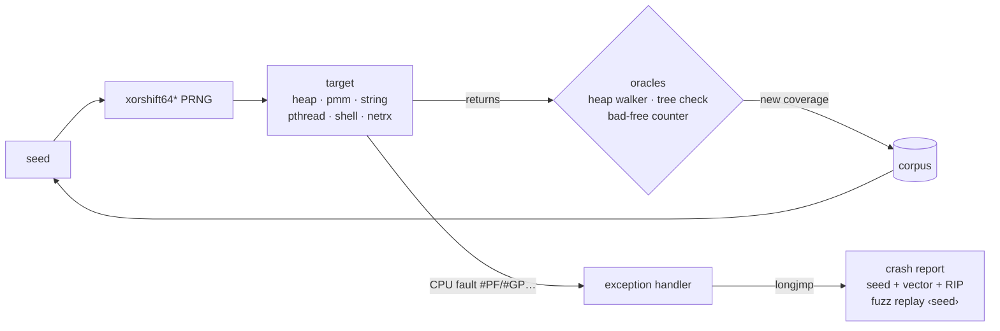

<div align="center">


### A from-scratch x86-64 operating system kernel that fuzzes itself from ring 0 — and compiles itself.

[](https://github.com/medaminkh-dev/MAKH/actions/workflows/ci.yml)
[](LICENSE)
[](LICENSING.md)


[Quick start](#-quick-start) · [What makes it different](#-what-makes-makhos-different) · [KFUZZ](#-kfuzz-the-kernel-fuzzes-itself) · [Shell](#-the-shell) · [Architecture](#-architecture) · [Docs](#-documentation)

</div>

---

**MakhOS** is a hobby **operating system** for **x86-64**, written from scratch in
freestanding **C** and **assembly** — no Linux, no BSD, no existing kernel underneath.
It boots with GRUB (Multiboot2), draws to a **framebuffer graphics console**,
schedules threads preemptively, runs **ring-3 user programs**, speaks **TCP/IP**
over a real Intel e1000 NIC, mounts **ext2** disks, and even **compiles C on itself**
with `tcc` + `make`.

Its signature: a **coverage-guided fuzzer that attacks the kernel from inside
ring 0** (KFUZZ), survives the CPU faults it provokes, and prints the exact seed
to reproduce each one.

Everything is built **brick by brick** (طوبة طوبة): a phase lands only when its
tests are green — **183 in-kernel tests**, a stress runner, and CI on every push.

```console
$ help
MAKH OS - a small x86-64 operating system, built brick by brick.
Running a user-space shell (ring 3) on MAKH's own kernel.
...
$ echo "brick by brick" | wc -w
3
$ ping 10.0.2.2 3
PING 10.0.2.2: 3 echo requests, 56 data bytes
64 bytes from 10.0.2.2: icmp_seq=1 ttl=255 time=0 ms
64 bytes from 10.0.2.2: icmp_seq=2 ttl=255 time=0 ms
64 bytes from 10.0.2.2: icmp_seq=3 ttl=255 time=0 ms
--- 10.0.2.2 ping statistics ---
3 packets transmitted, 3 received, 0% packet loss
rtt min/avg/max = 0/0/0 ms
```

## 🦊 What makes MakhOS different

Most hobby kernels print "Hello, World" and stop. MakhOS keeps going — and a
handful of things here are genuinely rare for a from-scratch OS:

- **It fuzzes its own kernel from ring 0.** KFUZZ runs a coverage-guided fuzzer
  *inside* the kernel, turning `#PF`/`#GP` faults into reproducible reports via an
  assembly `setjmp`/`longjmp` sandbox — instead of triple-faulting the machine.
- **It self-hosts.** MakhOS runs `tcc` and GNU `make` *on itself*, rebuilds a
  program it ships from source, and runs the result — the self-hosting summit for
  a kernel this size.
- **It runs real, unmodified binaries.** `busybox` and `musl`-libc static-PIE
  executables run as ordinary ring-3 processes, with `fork`/`execve`/`wait4`,
  pipes, job control and signals.
- **It has a real network stack.** PCI + Intel **e1000** over DMA, ARP, IPv4,
  ICMP, UDP and a full RFC 793 **TCP** (retransmission, fast retransmit, flow
  control, TIME_WAIT) behind a POSIX socket API — ~200 KB over loopback TCP in
  ~20 ms, byte-exact under 1-in-7 packet loss.
- **It looks like an OS.** A **framebuffer graphics console** with an antialiased
  font and a warm palette, a **fennec boot splash** with a spinning loader, and an
  interactive line-editing shell with **command history** and keyboard shortcuts.

<sub>Keywords: operating system · OS kernel · x86-64 · osdev · bare metal · freestanding C · hobby OS · kernel fuzzing · coverage-guided · ring 0 · TCP/IP stack · POSIX · ext2 · musl · self-hosting · framebuffer · QEMU</sub>

## ✨ Highlights

<table>
<tr>
<td width="50%" valign="top">

### 🧵 Preemptive multitasking
Priority run queues, quantum-based preemption at the IRQ tail, sleep,
wait queues with timeouts, and an idle reaper for detached threads.

### 🧩 Clean POSIX threads
`pthread_create/join/detach`, normal / recursive / error-checking mutexes,
condition variables, semaphores with `sem_timedwait`, TLS keys and a
per-thread `errno`.

### 🛡️ Self-checking memory
A kernel heap with a full integrity walker, stack canaries checked on every
context switch, a process-tree invariant checker, and x86 hardware
watchpoints for hunting stray writes.

</td>
<td width="50%" valign="top">

### 🌐 Real TCP/IP stack
PCI + Intel e1000 driver over DMA, ARP, IPv4, ICMP, UDP and a full RFC 793
TCP (retransmission, fast retransmit, flow control, TIME_WAIT) behind a
POSIX socket API.

### 🔬 KFUZZ self-fuzzer
Coverage-guided fuzzing of the kernel's own heap, page allocator, string
routines, pthreads, shell and network receive path — with a sandbox that
turns ring-0 faults into reproducible reports.

### 🖥️ Framebuffer console + shell
A graphics console (antialiased font, warm palette), a fennec boot splash,
and a ring-3 `/bin/sh` with pipes, job control, history and ~25 commands.

</td>
</tr>
</table>

## 🔬 KFUZZ: the kernel fuzzes itself

A bad input in ring 0 normally kills the machine. KFUZZ makes it a finding:



- **Sandbox** — `setjmp`/`longjmp` written in assembly; a fault inside a
  target unwinds back to the harness instead of halting the kernel.
- **Coverage** — subject code is built with `-fsanitize-coverage=trace-pc`;
  seeds that reach new edges are kept and mutated.
- **Oracles** — after every run the heap, the process tree and the free
  counters must still be consistent.
- **Watchdog** — a target that hangs is reported with its seed.
- **Replay** — `fuzz replay <seed> <target>` reproduces any finding exactly.

## 🖥️ The shell

MakhOS boots to a fennec splash, then hands off to an interactive **ring-3
`/bin/sh`** on a framebuffer console. The shell has pipelines (`a | b`), job
control (Ctrl+C / Ctrl+Z), a line editor with **command history** (Up/Down),
cursor movement (Left/Right, Ctrl+A/E), and kill/erase (Ctrl+U/K, Backspace).

Type `help` for the full A-to-Z. The `/bin` commands include:

| Area | Commands |
|---|---|
| Files | `ls -la` · `cat` · `cp` · `mv` · `ln -s` · `rm` · `mkdir` · `rmdir` · `touch` · `pwd` |
| Text | `echo` · `grep` · `head` · `tail` · `wc` · `sort` · `cut` |
| System | `whoami` · `id` · `uname` · `env` · `date` · `clear` · `sleep` |
| Network | `ping` (ttl + rtt min/avg/max) · `ifconfig` |
| Develop | `tcc` (Tiny C Compiler on MAKH) · `make` |

## 🧱 Architecture

```
┌──────────────────────────────────────────────────────────────┐
│  ring-3 /bin/sh + coreutils · tcc · make   KFUZZ (ring-0)     │
├──────────────────────────────────────────────────────────────┤
│  syscalls · ELF loader · fork/execve · signals · pipes · tty  │
├──────────────────────────────────────────────────────────────┤
│  VFS · tmpfs · devfs · ext2 (r/w) · tar initrd · virtio-blk   │
├──────────────────────────────────────────────────────────────┤
│  BSD sockets · TCP / UDP / ICMP · IPv4 · ARP · e1000 · PCI    │
├──────────────────────────────────────────────────────────────┤
│  preemptive scheduler · wait queues · pthreads · process tree │
├──────────────────────────────────────────────────────────────┤
│  PMM (bitmap) · VMM (paging, COW, NX/W^X) · heap (+ integrity)│
├──────────────────────────────────────────────────────────────┤
│  framebuffer console · GDT · IDT · PIC · PIT · TSS  (x86-64)  │
└──────────────────────────────────────────────────────────────┘
```

<details>
<summary><b>Source layout</b></summary>

```
kernel/
  arch/        GDT, IDT, PIC, TSS, context switch, debug registers
  mm/          physical/virtual memory, kernel heap
  proc/        PCB, process table/tree, PIDs, scheduler
  pthread/     POSIX threads, mutexes, condvars, semaphores
  drivers/     PCI, e1000, timer, keyboard, serial, framebuffer
  net/         Ethernet, ARP, IPv4, ICMP, UDP, TCP, sockets
  fs/          VFS, tmpfs, devfs, ext2, initrd (tar)
  syscall/     ring-3 syscall ABI, uaccess
  tty/         terminal line discipline
  kfuzz/       the ring-0 self-fuzzer
  tests/       in-kernel KTEST suites
user/          ring-3 shell + coreutils (ls, cat, grep, ping, ...)
tools/         test runner, keyboard-driven smoke test, stress runner
docs/          per-phase design documents (start at docs/README.md)
```

</details>

## 🚀 Quick start

You need `gcc`, `nasm`, `grub-mkrescue` (with `xorriso`) and
`qemu-system-x86_64`.

```sh
git clone https://github.com/medaminkh-dev/MAKH.git && cd MAKH
make            # build makhos.kernel + makhos.iso
make run        # boot it in QEMU
```

Watch the fennec splash, then type `help` at the `$` prompt.

## ✅ Testing

| Command | What it does |
|---|---|
| `make test` | Boots a headless self-test image, runs every `KTEST` (incl. fuzz campaigns), exits pass/fail |
| `make smoke` | Boots the real image and types shell commands through the emulated keyboard |
| `make stress` | Runs the whole suite many times in parallel to flush out timing bugs |
| `make check-license` | Verifies every source file carries its SPDX license header |

CI runs the suite and a stress job on every push.

## 📈 Milestones

Boot → memory → interrupts → **preemptive scheduler** → **POSIX threads** →
**TCP/IP + e1000** → **KFUZZ** → **ring-3 userspace** → **COW address spaces** →
**VFS + ext2** → **signals, pipes, job control** → **musl + busybox** →
**self-hosting (tcc + make on MAKH)** → **higher-half kernel** →
**framebuffer console + fennec splash** → interactive shell with history.

Every milestone is a phase with its own design document and a green test suite.
The full, ordered list — 40+ phases, each linked to its doc — lives in the
**[docs map](docs/README.md)**.

## 📚 Documentation

The design docs are not in this README on purpose — they live in
**[`docs/`](docs/)**, one per phase, threaded in order by the
**[docs map](docs/README.md)**: from boot through the
[user process model](docs/PHASE20A_PROCESS_MODEL.md), by way of
[networking](docs/PHASE14_NETWORK.md), the [KFUZZ](docs/PHASE15_KFUZZ.md)
self-fuzzer, [self-hosting](docs/PHASE21D_SELFHOST.md) and the
[framebuffer console](docs/PHASE25_FRAMEBUFFER_CONSOLE.md).

## ⚖️ License

MakhOS is **dual-licensed**:

- **[GNU AGPL-3.0](LICENSE)** — free for everyone who shares their
  modifications, including when running a modified MakhOS as a network
  service.
- **[Commercial license](LICENSING.md)** — for products, appliances and
  hosted services that need to keep their changes private, or want support
  and a warranty.

Earlier revisions were published under BSD-3-Clause; see [NOTICE](NOTICE).
"MakhOS", "MAKH" and "KFUZZ" are project names and are not licensed for use
by modified versions.

## 🤝 Contributing

Contributions are welcome — please read [CONTRIBUTING.md](CONTRIBUTING.md)
and sign the [CLA](CLA.md) in your first pull request.

## 📖 The story

The original `main` became unstable: features were piling up on a fragile
process foundation, and every fix created two new bugs. So we stopped,
stepped back to Phase 8 — the last solid point — and rebuilt one phase at a
time, with tests meaner than any user.

> Sometimes you have to go backward to move forward.

<div align="center">

**MakhOS** · © 2026 Amine Khemissi · AGPL-3.0-only or commercial

</div>
