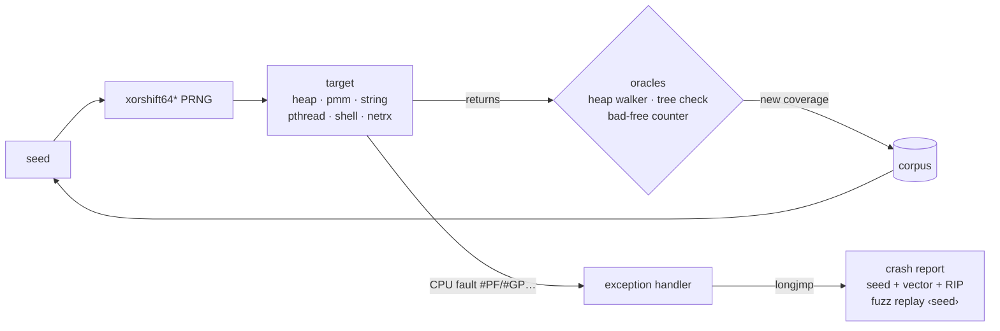

<div align="center">

```
 ███╗   ███╗ █████╗ ██╗  ██╗██╗  ██╗
 ████╗ ████║██╔══██╗██║ ██╔╝██║  ██║
 ██╔████╔██║███████║█████╔╝ ███████║
 ██║╚██╔╝██║██╔══██║██╔═██╗ ██╔══██║
 ██║ ╚═╝ ██║██║  ██║██║  ██╗██║  ██║
 ╚═╝     ╚═╝╚═╝  ╚═╝╚═╝  ╚═╝╚═╝  ╚═╝
```

### An x86-64 kernel that tests itself — from the inside, in ring 0.

[](https://github.com/medaminkh-dev/MAKH/actions/workflows/ci.yml)
[](LICENSE)
[](LICENSING.md)


[Quick start](#-quick-start) · [Highlights](#-highlights) · [KFUZZ](#-kfuzz-the-kernel-fuzzes-itself) · [Architecture](#-architecture) · [Docs](#-documentation) · [License](#-license)

</div>

---

**MakhOS** is a from-scratch operating system kernel for x86-64, written in
freestanding C and assembly. It boots with GRUB, schedules threads
preemptively, speaks TCP/IP over a real NIC driver — and it carries its own
**coverage-guided fuzzer that attacks the kernel from inside ring 0**,
surviving the faults it provokes and printing the exact seed to reproduce
each one.

It is built **brick by brick**: every phase lands only when its tests are
green.

```console
MakhOS> ping 10.0.2.2 3
PING 10.0.2.2: 3 echo requests
reply from 10.0.2.2: seq=1 time=250 ms
reply from 10.0.2.2: seq=2 time=100 ms
reply from 10.0.2.2: seq=3 time=100 ms
--- 10.0.2.2: 3 sent, 3 received, 0% loss
MakhOS> fuzz netrx 300
fuzzing 300 iterations...
done: 300 iters, 0 crashes, 0 oracle-fails, coverage 184 edges, corpus 2
```

## ✨ Highlights

<table>
<tr>
<td width="50%" valign="top">

### 🧵 Preemptive multitasking
Priority run queues, quantum-based preemption at the IRQ tail, sleep,
wait queues with timeouts, and an idle reaper for detached threads.

### 🧩 Clean POSIX threads
`pthread_create/join/detach`, normal / recursive / error-checking mutexes,
condition variables, semaphores with `sem_timedwait`, TLS keys and a
per-thread `errno`.

### 🛡️ Self-checking memory
A kernel heap with a full integrity walker, stack canaries checked on every
context switch, a process-tree invariant checker, and x86 hardware
watchpoints for hunting stray writes.

</td>
<td width="50%" valign="top">

### 🌐 Real TCP/IP stack
PCI + Intel e1000 driver over DMA, ARP, IPv4, ICMP, UDP and a full RFC 793
TCP (retransmission, fast retransmit, flow control, TIME_WAIT) behind a
POSIX socket API. 200 KB over loopback TCP in ~20 ms; survives 1-in-7
packet loss byte-exact.

### 🔬 KFUZZ self-fuzzer
Coverage-guided fuzzing of the kernel's own heap, page allocator, string
routines, pthreads, shell and network receive path — with a sandbox that
turns ring-0 faults into reproducible reports.

### 🖥️ Built-in shell
`ifconfig` · `arp` · `ping` · `netstat` · `ps` · `mem` · `heapcheck` ·
`fuzz` · `selftest` — all scriptable through `shell_exec()`.

</td>
</tr>
</table>

## 🔬 KFUZZ: the kernel fuzzes itself

A bad input in ring 0 normally kills the machine. KFUZZ makes it a finding:



- **Sandbox** — `setjmp`/`longjmp` written in assembly; a fault inside a
  target unwinds back to the harness instead of halting the kernel.
- **Coverage** — subject code is built with `-fsanitize-coverage=trace-pc`;
  seeds that reach new edges are kept and mutated.
- **Oracles** — after every run the heap, the process tree and the free
  counters must still be consistent.
- **Watchdog** — a target that hangs is reported with its seed.
- **Replay** — `fuzz replay <seed> <target>` reproduces any finding exactly.

## 🧱 Architecture

```
┌──────────────────────────────────────────────────────────────┐
│  shell (shell_exec)            KFUZZ (sandbox · coverage)     │
├──────────────────────────────────────────────────────────────┤
│  BSD sockets  ·  TCP / UDP / ICMP  ·  IPv4  ·  ARP  ·  Eth   │
│  netd thread + net_lock                                       │
├───────────────────────────┬──────────────────────────────────┤
│  pthreads · sem · errno   │  e1000 · PCI · loopback           │
├───────────────────────────┴──────────────────────────────────┤
│  preemptive scheduler · wait queues · process table/tree      │
├──────────────────────────────────────────────────────────────┤
│  PMM (bitmap) · VMM (paging) · kernel heap (+ integrity walk) │
├──────────────────────────────────────────────────────────────┤
│  GDT · IDT · PIC · PIT · TSS · debug registers  (x86-64)      │
└──────────────────────────────────────────────────────────────┘
```

<details>
<summary><b>Source layout</b></summary>

```
kernel/
  arch/        GDT, IDT, PIC, TSS, context switch, debug registers
  mm/          physical/virtual memory, kernel heap
  proc/        PCB, process table/tree, PIDs, scheduler
  pthread/     POSIX threads, mutexes, condvars, semaphores
  drivers/     PCI, e1000, timer, keyboard, serial
  net/         Ethernet, ARP, IPv4, ICMP, UDP, TCP, sockets
  shell/       the command shell
  kfuzz/       the ring-0 self-fuzzer
  tests/       in-kernel KTEST suites
tools/         test runner, keyboard-driven smoke test, stress runner
docs/          per-phase design documents
```

</details>

## 🚀 Quick start

You need `gcc`, `nasm`, `grub-mkrescue` (with `xorriso`) and
`qemu-system-x86_64`.

```sh
git clone https://github.com/medaminkh-dev/MAKH.git && cd MAKH
make            # build makhos.kernel + makhos.iso
make run        # boot it in QEMU
```

Type `help` at the `MakhOS>` prompt.

## ✅ Testing

| Command | What it does |
|---|---|
| `make test` | Boots a headless self-test image, runs every `KTEST` (incl. fuzz campaigns), exits pass/fail |
| `make smoke` | Boots the real image and types shell commands through the emulated keyboard |
| `make stress` | Runs the whole suite many times in parallel to flush out timing bugs |
| `make check-license` | Verifies every source file carries its SPDX license header |

CI runs the suite and a stress job on every push.

## 📈 Status

| Phase | Milestone | |
|---|---|---|
| 1–9 | Boot, VGA/serial, memory, interrupts, timer, keyboard, GDT/TSS, syscall MSRs, processes | ✅ |
| 11 | In-kernel test harness, `kprintf`, panic backtraces | ✅ |
| 12 | Preemptive priority scheduler, sleep, wait queues | ✅ |
| 13 | POSIX threads API | ✅ |
| 14 | Networking: PCI, e1000, TCP/IP, sockets, shell | ✅ [docs](docs/PHASE14_NETWORK.md) |
| 15 | KFUZZ ring-0 self-fuzzer | ✅ [docs](docs/PHASE15_KFUZZ.md) |
| 16 | Ring-3 userspace: syscall/sysret ABI, uaccess, fault containment | ✅ [docs](docs/PHASE16_USERSPACE.md) |
| 17 | VM v2: per-process address spaces, copy-on-write, NX/W^X | ✅ [docs](docs/PHASE17_VMV2.md) |
| 18 | Filesystem: VFS, tmpfs, devfs, tar initrd, fd/syscalls | ✅ [docs](docs/PHASE18_VFS.md) |
| 19 | Signals, process groups, TTY line discipline (Ctrl+C / job control) | ✅ [docs](docs/PHASE19_SIGNALS_TTY.md) |
| 20-A | User process model: ELF load, preemptible ring 3, per-process address space, `waitpid` | ✅ [docs](docs/PHASE20A_PROCESS_MODEL.md) |
| 20-B | Anonymous memory: `brk`, `mmap`/`munmap`/`mprotect` | ✅ [docs](docs/PHASE20B_MMAP_BRK.md) |
| 20-C | Working directory: per-process cwd, `chdir`/`getcwd`, relative paths | ✅ [docs](docs/PHASE20C_CWD.md) |
| 20-A-2 | `fork` (copy-on-write) + `execve` (replace image) + `wait4` | ✅ [docs](docs/PHASE20A2_FORK_EXECVE.md) |
| 20-D | Controlling terminal: blocking `read`, Ctrl+C, interactive `/bin/sh` (`makh.sh`) | ✅ [docs](docs/PHASE20D_SHELL.md) |
| 20-E | `argv`/`envp`/`auxv`: SysV initial stack, `umain(argc, argv)`, shell argument parsing | ✅ [docs](docs/PHASE20E_ARGV.md) |
| 20-F | Job control: `setpgid`/`getpgid`/`setsid`, `ioctl(TIOCSPGRP)`, Ctrl+C hits the job | ✅ [docs](docs/PHASE20F_JOBCTL.md) |
| 20-G | User signal handlers: `sigaction`/`sigprocmask`/`sigreturn`, signal frame on the user stack | ✅ [docs](docs/PHASE20G_SIGNALS.md) |
| 20-H | Thread-local storage: `arch_prctl(ARCH_SET_FS)`, per-process FS base (musl enabler) | ✅ [docs](docs/PHASE20H_TLS.md) |
| 20-I | Time & randomness: `clock_gettime`/`gettimeofday`/`nanosleep`/`getrandom` (xoshiro256**) | ✅ [docs](docs/PHASE20I_TIME_RANDOM.md) |
| 20-J | File metadata & listing: `stat`/`fstat`/`getdents64`/`fcntl` (byte-exact `struct stat`) | ✅ [docs](docs/PHASE20J_STAT.md) |
| 20-K | Pipes & redirection: `pipe`/`pipe2`/`dup2`, fd inheritance, shell `a \| b` pipelines | ✅ [docs](docs/PHASE20K_PIPE.md) |
| 20-L | User threads: `clone`+`futex`+`set_tid_address` (shared VM/fds, futex-join) | ✅ [docs](docs/PHASE20L_THREADS.md) |
| 20-M | Wall clock: CMOS RTC anchors `CLOCK_REALTIME`/`gettimeofday` to a real epoch | ✅ [docs](docs/PHASE20M_RTC.md) |
| 20-N | musl-readiness: `writev`/`readv`/`exit_group`/`madvise` (buffered-stdio path) | ✅ [docs](docs/PHASE20N_IOV.md) |
| 20-O | **A real C program on musl libc**: static-PIE loader + full auxv + the lost-FS-base fix | ✅ [docs](docs/PHASE20O_MUSL.md) |
| 20-O2 | **busybox `sh` runs**: real busybox static-PIE, `getppid`/uid family, spawn-with-argv | ✅ [docs](docs/PHASE20O2_BUSYBOX.md) |
| 20-P | **Persistent storage**: polled legacy **virtio-blk** disk, read/write sectors (gap #2 begins) | ✅ [docs](docs/PHASE20P_VIRTIO_BLK.md) |
| 20-Q | **ext2 filesystem** (read-only): mount an on-disk ext2 from virtio-blk into the VFS | ✅ [docs](docs/PHASE20Q_EXT2.md) |
| 20-R | **ext2 write path**: create + write on-disk files (block/inode alloc, dir entries) | ✅ [docs](docs/PHASE20R_EXT2_WRITE.md) |
| 20-S | **Toolchain syscalls**: `execve` envp + `openat`/`*at` family; musl file I/O on ext2 | ✅ [docs](docs/PHASE20S_G3_SYSCALLS.md) |
| 20-T | **ext2 directory ops**: `mkdir`/`unlink`/`rmdir`/`rename`/`truncate` (ext2 now read/write) | ✅ [docs](docs/PHASE20T_EXT2_DIROPS.md) |
| 21 | **Higher-half kernel**: kernel relinked to the top -2 GiB + HHDM; the lower canonical half is freed per-process, so a standard non-PIE binary runs at `0x400000` | ✅ [docs](docs/PHASE21_HIGHERHALF.md) |
| 21-A | **Self-hosting begins**: `tcc` runs *on MAKH*, compiles C to a native `0x400000` executable, and MAKH runs the result (F21) | ✅ [docs](docs/PHASE21A_SELFHOST_TCC.md) |

## 📚 Documentation

Every phase has a design document in [`docs/`](docs/); start with the
[**docs map**](docs/README.md), which threads all phases in order — from boot
through the [user process model](docs/PHASE20A_PROCESS_MODEL.md), by way of
[networking](docs/PHASE14_NETWORK.md) and the [KFUZZ](docs/PHASE15_KFUZZ.md)
self-fuzzer.

## ⚖️ License

MakhOS is **dual-licensed**:

- **[GNU AGPL-3.0](LICENSE)** — free for everyone who shares their
  modifications, including when running a modified MakhOS as a network
  service.
- **[Commercial license](LICENSING.md)** — for products, appliances and
  hosted services that need to keep their changes private, or want support
  and a warranty.

Earlier revisions were published under BSD-3-Clause; see [NOTICE](NOTICE).
"MakhOS", "MAKH" and "KFUZZ" are project names and are not licensed for use
by modified versions.

## 🤝 Contributing

Contributions are welcome — please read [CONTRIBUTING.md](CONTRIBUTING.md)
and sign the [CLA](CLA.md) in your first pull request.

## 📖 The story

The original `main` became unstable: features were piling up on a fragile
process foundation, and every fix created two new bugs. So we stopped,
stepped back to Phase 8 — the last solid point — and rebuilt one phase at a
time, with tests meaner than any user.

> Sometimes you have to go backward to move forward.

<div align="center">

**MakhOS** · © 2026 Amine Khemissi · AGPL-3.0-only or commercial

</div>
